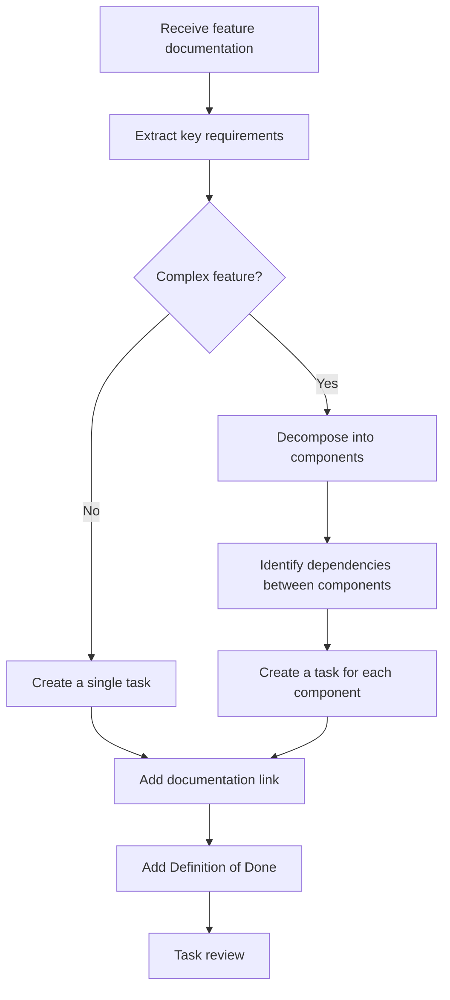

# Game Dev Task Creation
This skill describes the process of creating tasks for **programmers** on a game development team. A task must be concise, precise, reference documentation, and be broken down into components when necessary.
> [!IMPORTANT]
> A task is not a copy of the documentation. It is a **clear technical assignment** that a programmer can pick up and work on without additional questions.
---
## Input Data
Before creating a task, make sure you have:
1. **Feature documentation** — a link or contents of the document describing the feature
2. **Project context** — tech stack, architectural patterns, existing systems
3. **Priority and scope** — what exactly needs to be done now (MVP, full implementation, prototype)
---
## Task Structure
Each task must contain the following sections:
### 1. Title
Brief, specific, starts with a verb.
**Good:**
- `Implement inventory system with drag & drop`
- `Add network synchronization for player health`
- `Create crafting window UI`
**Bad:**
- `Inventory`
- `Work on feature X`
- `Crafting bug`
### 2. Description
A short description (2-4 sentences) answering:
- **What** needs to be done?
- **Why** is it needed? (gameplay context)
- **Where** will it be used? (which system / screen / scene)
### 3. Documentation Link
```
📄 Documentation: [Document Name](link)
```
If the documentation covers more than the task scope — specify the relevant sections:
```
📄 Documentation: [Inventory System](link) — sections 2.1 "Slots" and 2.3 "Item Stacking"
```
### 4. Key Requirements
A numbered list of **specific** technical requirements. Don't rewrite the docs — extract the essentials.
```markdown
**Requirements:**
1. Inventory with 20 slots in a 4×5 grid
2. Items stack up to `maxStackSize` value from config
3. Drag & drop between slots with animation (duration: 0.2s)
4. State persistence via PlayerPrefs / Save System
5. Events: `OnItemAdded`, `OnItemRemoved`, `OnItemMoved`
```
### 5. Definition of Done
A clear checklist for when the task is considered complete:
```markdown
**Done when:**
- [ ] All requirements implemented
- [ ] Code review passed
- [ ] Unit tests written for core logic
- [ ] No console errors during standard use-case
- [ ] Verified on target platforms
```
### 6. Technical Notes (optional)
Implementation hints, references to existing systems, constraints:
```markdown
**Notes:**
- Use existing `ItemDatabase` for item data
- Build UI with `UIToolkit` / `UGUI` (confirm with lead)
- Consider integration with crafting system (task #42)
```
---
## Decomposition into Components
> [!TIP]
> Decomposition is needed when a feature touches **multiple systems** or when implementation by one person would take **more than 2-3 days**.
### When to Decompose
| Signal | Example |
|--------|---------|
| Feature spans multiple layers (UI + logic + networking) | Inventory with multiplayer |
| There are dependencies between parts | Crafting depends on inventory |
| Different people can work in parallel | UI and server logic |
| Implementation > 3 days for one developer | Large combat system |
### How to Decompose
Break down by **architectural layers** or **functional blocks**:
```
🔗 Parent feature: [Inventory System](link-to-documentation)
Components:
├── [TASK-101] Inventory data model (InventoryModel, ItemSlot, StackLogic)
├── [TASK-102] Inventory UI (InventoryView, SlotWidget, DragHandler)
├── [TASK-103] Serialization and persistence (InventorySaveData, SaveManager)
└── [TASK-104] Network synchronization (InventoryNetSync, RPCs)
```
For each component, create a **separate task** following the structure above, adding:
```markdown
**Dependencies:** TASK-101 (data model required)
**Related tasks:** TASK-102, TASK-104
```
### Decomposition Principles
1. **Each component is an independently testable unit.** It can be verified without the others.
2. **Minimize coupling between components.** Communicate through interfaces / events.
3. **Clear boundaries.** One component = one layer or one subsystem.
4. **Size: 0.5–3 days of work** per component.
---
## Task Creation Process

### Steps
1. **Read the documentation** in full. Understand the context and purpose of the feature.
2. **Extract key requirements.** Not everything in the docs is a task. Remove the noise, keep actionable items.
3. **Estimate complexity.** If > 3 days — decompose.
4. **Write the task** following the structure above.
5. **Add links** to documentation with specific sections referenced.
6. **Specify dependencies**, if there are related tasks.
7. **Verify:** can a programmer start working on this task right now?
---
## Task Template
```markdown
# [Verb] + [What] + [Context]
## Description
[2-4 sentences: what, why, where]
📄 **Documentation:** [Name](link) — sections X, Y
## Requirements
1. [Specific requirement with parameters]
2. [...]
## Definition of Done
- [ ] All requirements implemented
- [ ] Code review passed
- [ ] Unit tests for core logic
- [ ] No console errors
- [ ] Verified on target platform
## Dependencies
- [TASK-XXX] — [brief description of dependency]
## Technical Notes
- [Implementation hint]
- [Reference to existing system]
```
---
## Anti-patterns
> [!CAUTION]
> Avoid these mistakes when creating tasks.
| ❌ Anti-pattern | ✅ How to do it right |
|---|---|
| Copy the entire documentation into the task | Extract only requirements, reference the document |
| Vague wording: "make it good" | Specific parameters: "response time < 16ms" |
| One giant task for the entire feature | Decompose into components |
| No link to documentation | Always include a link with specific sections |
| Items without context: "add a button" | "Add 'Craft' button to inventory UI (see mockup in docs, section 3.2)" |
| No definition of done | Always add Definition of Done |
---
## Example
### Input Data
- Documentation: "Crafting System" (link)
- Scope: MVP — simple crafting without network synchronization
### Result
**Parent feature:** Crafting System
📄 Documentation: [Crafting System](link)
---
#### TASK-201: Implement crafting data model
**Description:**
Create the data model for the crafting system. The model describes recipes (ingredients → result) and the logic for checking craft availability based on inventory contents.
📄 Documentation: [Crafting System](link) — section 1 "Recipes" and section 2 "Crafting Logic"
**Requirements:**
1. `CraftRecipe` class: list of ingredients (`ItemId` + `count`), result (`ItemId` + `count`)
2. `CraftingSystem.CanCraft(recipe, inventory)` — check ingredient availability
3. `CraftingSystem.Craft(recipe, inventory)` — execute craft, removing ingredients
4. Recipes loaded from ScriptableObject / JSON config
5. Events: `OnCraftSuccess`, `OnCraftFailed`
**Done when:**
- [ ] All requirements implemented
- [ ] Unit tests for `CanCraft` and `Craft`
- [ ] Code review passed
**Dependencies:** none (data model is independent)
**Notes:**
- Use `ItemDatabase` from the inventory system
- `ICraftingSystem` interface for future test mocking
---
#### TASK-202: Create crafting window UI
**Description:**
Implement a crafting UI panel displaying available recipes and allowing the player to craft by pressing a button. Integrates with `CraftingSystem` from TASK-201.
📄 Documentation: [Crafting System](link) — section 4 "Crafting UI", mockups in Figma
**Requirements:**
1. Recipe list with ingredient and result icons
2. Availability indicator (enough / not enough ingredients)
3. "Craft" button — active only when `CanCraft == true`
4. Successful craft animation (feedback, 0.3s)
5. Panel open/close via `C` key (rebindable)
**Done when:**
- [ ] All requirements implemented
- [ ] Visually matches mockup from documentation
- [ ] Works with test data
- [ ] Code review passed
**Dependencies:** TASK-201 (crafting data model)
